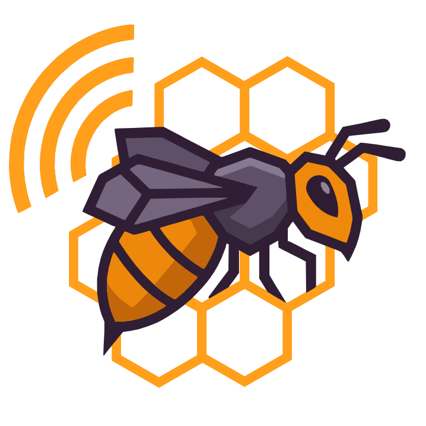
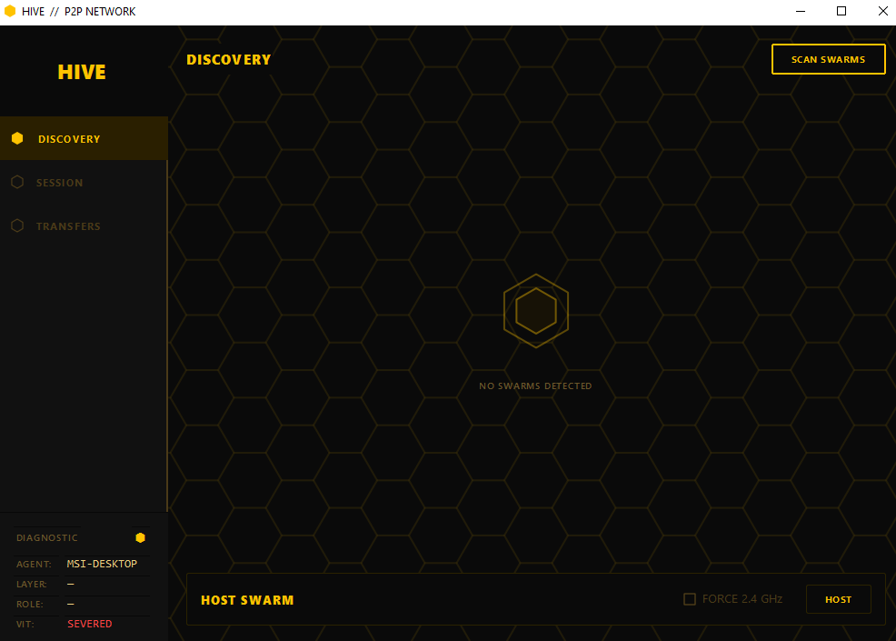

#  Hive: Home Interconnections Versatile Extensible

| Metadata | Details |
| :--- | :--- |
| **Version** | 1.1.1 |
| **Scope** | Infrastructure-less P2P Communication & Resilient File Transfer |
| **Target** | Windows (WinRT) & Linux (D-Bus) |

---

## 1. Summary

**Hive** is a cross-platform system enabling devices to spontaneously form a high-speed local network and exchange files/messages without a router, internet access, or manual configuration.

It utilizes a 2-Layer architecture to decouple the Physical Link from the Logical Link, ensuring stability even if the physical network topology changes. Hive primarily utilizes Wi-Fi Direct technology.

### 1.1 The Operation shouldn't require:

* A router or external access point.
* Ethernet cables or physical tethering.
* Manual IP or network configuration by the user.

### 1.2 The system should automatically:

* Discover nearby Hive-enabled peers via standardized service IDs.
* Establish robust link-layer connectivity.
* Elect autonomous coordination roles (**Swarm Leader**).
* Facilitate resilient data exchange under hardware failure scenarios.
Without the requirement of the user.

### 1.3 Chosen Connectivity Technology: Wi-Fi Direct

* Only mainstream technology that supports ad-hoc wireless links with high throughput (LAN-class speeds) without user configuration.
* **SSID Prefix:** `DIRECT-HV-`
* **Service UUID:** `00000001-4856-4147-454E-540000000001` [HVAGENT Distinction]
* **Default Passphrase:** `Hive12345678`

---

## 2. System Architecture

To resolve conflicts between high-level logic (UI/Sockets) and low-level driver control, the system is split into two distinct processes communicating via **Standard I/O (Control Plane)** and specialized **OS Pipes/Sockets (Data Plane)**.

### 2.1 Component A: Hardware Agent (C++)
* **Role:** Hardware Abstraction Layer (HAL).
* **Breakthrough Implementation:**
    * **Windows:** C++ (C++/WinRT) utilizes the `WiFiAdapter` SSID scanning breakthrough to bypass NCSI interference, providing reliable discovery of `DIRECT-` networks.
    * **Linux:** Pure native D-Bus integration using event-driven signal architecture for asynchronous confirmation of group events.
* **Responsibilities:** Group management (Scanning, Provisioning), Radio Telemetry (ACPI, RAM, Link Speed), and local Data Plane hosting.

### 2.2 Component B: Application (Python)
* **Role:** Session Manager & User Interface.
* **Implementation:** Python 3.11+ (subprocess orchestration, encrypted control/data framing).
* **Responsibilities:** Session Management (TCP/UDP Socket overlay), Election Logic (Vitality Scoring), Security (Argon2id + AES-256-GCM), and File Chunking.

---

## 3. Network Topology

### Layer 1: Physical Link
* **Role:** Interface Role.
* **Function:** Acts as the Physical Access Point (**Group Owner**) or Connected Node (**Peer Node**).
* **Assignment:** Determined by the OS/Driver negotiation.
* **Failure Mode:** "Group Owner Death."
    * *Recovery:* Nodes enter Panic Mode, scan for `DIRECT-HV-` prefix, and auto-regroup.

### Layer 2: Logical Link
* **Role:** Swarm Status.
* **Function:** The Logical Coordinator (**Leader** or **Peer**). Leader maintains the Peer Registry and authorizes transfers.
* **Assignment:** Determined by the Hive Election Protocol.
* **Failure Mode:** "Leader Death."
    * *Recovery:* Nodes detect heartbeat timeout, hold elections, and promote the next highest scoring peer.

---

## 4. Governance & Election Logic

### 4.1 Vitality Score
Every node calculates a score to represent its fitness to host.

$$Score = 50 + \underbrace{\begin{cases} +50 & \text{AC Power} \\ -20 & \text{Battery} \end{cases}}_{\text{Power Source}} + \underbrace{15 \cdot \mathbb{I}(R > 8) + 15 \cdot \mathbb{I}(R > 16)}_{\text{RAM (Cumulative)}} + \underbrace{20 \cdot \mathbb{I}(C > 6 \text{ Cores})}_{\text{Logical Cores}}$$

### 4.2 Non-Preemption
To prioritize network stability, Hive enforces a strict non-aggression rule:
> **Rule:** If a Swarm Leader is already active, election bids are cancelled. We do not destabilize a working network to upgrade the Leader based on score alone.

---

## 5. State Management & Recovery

### 5.1 Hardware Agent States
1.  **READY:** Agent initialized and idling.
2.  **DISCONNECTED:** Agent is scanning or idle.
3.  **SCANNING:** Active discovery in progress.
4.  **ASSOCIATING:** L1/L2 link negotiation in progress.
5.  **CONNECTED_AS_CLIENT:** Peer joined as client.
6.  **CONNECTED_AS_GO:** Peer initialized as Group Owner.

### 5.2 Recovery Scenarios
* **Scenario A: Leader Death:** Nodes initiate an election after heartbeats time out. TCP timeout/retry handles the pause.
* **Scenario B: Group Owner Death:** C++ agent detects link loss, triggers an automatic scan, and rebuilds the physical group.

---

## 6. Protocol Specification (SWARM)
* Hive uses a custom protocol known as the **Selection Welcome Awaition Response Mediator** Protocol (or SWARM) as the basis for Elections and Sessions in the Network.
* **Transport:**
    * **UDP (Port Range 5000-5010):** Discovery & Election.
    * **TCP (Port Range 5000-5010):** Session Control.
    * **TCP (Port Range 5001-5011):** High-Speed Data Plane.
* **Packet Structure:** `[ Header (12 Bytes) ] + [ Payload (N Bytes Encrypted JSON) ]`

### 6.1 Security Layer
* **Mechanism:** AES-256 (GCM Mode).
* **Key Derivation:** Argon2id (Memory-Hard KDF).
* **Firewall:** Utilizes port-restricted app-bound rules for maximum security.

---

## 7. Data Transfer Subsystem

### 7.1 Data Plane Implementation
Raw binary data is streamed via the C++ agent's high-performance raw relay bridge:
* **Windows:** Dynamic Local TCP Bridge.
* **Linux:** Unix Domain Sockets (`/tmp/hive_<port>.sock`).

### 7.2 Chunking and Resume
* **Chunk Size:** **128 KB (131,072 bytes)** — empirically validated as the optimum for Windows `asyncio`. Minimizes event-loop blocking while maintaining high throughput.
* **Persistence:** Receiver logs byte offsets and performs a disk sync (`os.fsync`) upon completion to support interruption recovery and ensure file visibility.
* **End-of-Transfer Handshake:** Includes a mandatory `MSG_P2P_DONE` signal from the receiver to prevent premature connection closure and "96% hangs."

---

## 8. Security & Threat Model

### 8.1 Threat: Lurker
* **Scenario:** Attacker sits physically nearby and captures Wi-Fi packets.
* **Mitigation:** AES-256 (GCM) Payload Encryption. Even if the attacker joins the Physical Link (L1), they cannot decode the Logical Link (L2) traffic without the Room PIN. Argon2id KDF makes brute-forcing the PIN computationally expensive.

### 8.2 Threat: Bad Host
* **Scenario:** Malicious Leader redirects a file transfer to themselves.
* **Mitigation:** **Identity Challenge (End-to-End).** During `P2P_HANDSHAKE`, the Sender challenges the Receiver to prove they own the `target_uuid` via signed cryptographic signatures.

### 8.3 Threat: DoS / Spammer
* **Scenario:** Malicious Actor attempts disruption via flooding JOIN requests.
* **Mitigation:** Capacity Limiter. The Leader enforces node limits and ignores malformed/unsolicited packets.

---

## 9. User Interface

The Hive interface is designed for high-visibility and ease of use with a dark-themed aesthetic, as shown in the image below:



---

## 10. Implementation Directives

### 10.1 Directory Structure

```text
Hive/
├── app/
│   ├── main.py
│   └── core/
│       ├── agent.py
│       ├── controller.py
│       ├── protocol.py
│       ├── session.py
│       ├── network.py
│       ├── data_plane.py
│       └── security.py
├── agents/
│   ├── win32/
│   │   └── HiveAgent.exe           <- C++/WinRT HAL
│   ├── linux/
│   │   └── HiveAgent               <- Native D-Bus HAL
│   └── shared/
│       ├── protocol.json           <- Shared Command Schema
│       └── constants.hpp
├── dist_tools/
│   ├── build.py                    <- Unified build, test & bundle script
│   ├── setup-hive.ps1              <- Windows port-restricted setup
│   ├── remove-hive.ps1             <- Windows teardown
│   ├── setup-hive.sh               <- Linux D-Bus/netdev setup
│   └── remove-hive.sh              <- Linux teardown
├── tests/
│   ├── integration/
│   │   └── test_local_cluster.py   <- 3-Node Swarm Simulation
│   ├── conftest_utils.py           <- Standardized Mocks
│   └── *.py
└── hive.spec
```

## 11. Project Roadmap & Documentation
For detailed guides on usage, testing, and development, refer to:
* [SPECIFICATION.md](docs/SPECIFICATION.md): Detailed protocol and state definitions.
* [DEVELOPMENT_AND_BUILD.md](docs/DEVELOPMENT_AND_BUILD.md): Compilation and integration guide.
* [USAGE_AND_TESTING.md](docs/USAGE_AND_TESTING.md): Swarm workflows, hardware setup, and automated testing.
* [RESEARCH_AND_HISTORY.md](docs/RESEARCH_AND_HISTORY.md): Evolution of the Sidecar pattern and breakthroughs.

## 12. Development & CLI Usage

### 12.1 Build & Test
To build the release bundle and run the test suite:
```powershell
python dist_tools\build.py
```

### 12.2 Launch Options
The Hive executable supports the following flags:
* `--debug`: Enables verbose DEBUG logging to stderr.
* `--inspector`: Performs an end-to-end hardware and connectivity check.
* `--pin <4-digit PIN>`: Sets the Room PIN for session encryption (Default: 0000).
* `--mock <path>`: Allows developers to point to a custom mock agent binary.

### 12.3 Swarm Simulation (Local)
To verify the multi-instance and election logic without WiFi hardware:
```powershell
pytest tests/integration/test_local_cluster.py -v -s
```

## 13. Performance Optimization

* **Chunk Size:** 128 KB per encrypted chunk — optimized for Windows `asyncio` loop stability and high-frequency UI updates.
* **TCP Buffering:** Match-tuned 128KB relay buffers in C++ to prevent IPC bottlenecks.
* **Multi-Instance Support:** Dynamic port allocation (5000-5010 control, 5001-5011 data) enables full swarm simulation on a single developer machine.
* **Network Defense:** Windows utilizes Interface Metric 1 and TCP anchoring to prevent NCSI link drops.
* **Ruthless Mode:** Forcing 2.4 GHz operation via hardware agents to ensure compatibility with legacy and survival-grade hardware.
